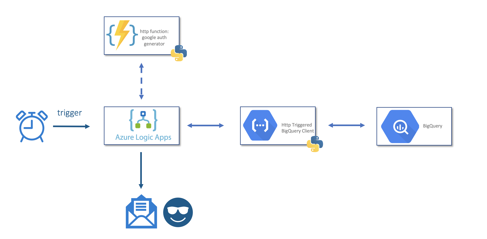

# functions-demo
 Azure Logic App for sending scheduled excel reports from Google BigQuery

# What is serverless:
 - Highest level of abstraction in compute services

# Benefits
 - Resource efficient: right sizing, consumption based, separation of compute & storage
 - Ease of development & maintenance
 - Portability

# Use Cases
 - Automation (scripting)
 - Data processing (ETL)
 - Microservice (serving ML models)
 - APIs
 - ?

